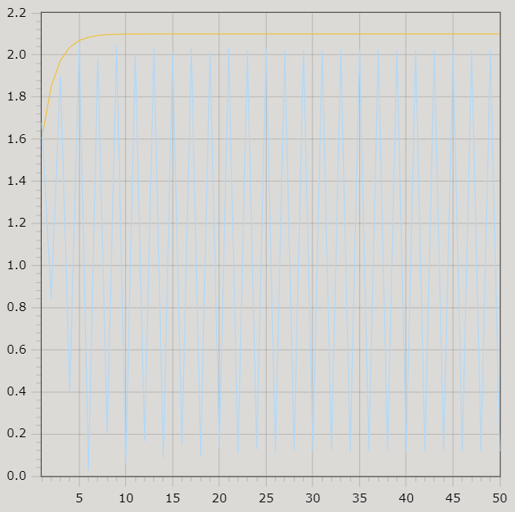

<p align="center"> Министерство образования Республики Беларусь</p>
<p align="center">Учреждение образования</p>
<p align="center">“Брестский Государственный технический университет”</p>
<p align="center">Кафедра ИИТ</p>
<br><br><br><br><br><br><br>
<p align="center">Лабораторная работа №1</p>
<p align="center">По дисциплине “Общая теория интеллектуальных систем”</p>
<p align="center">Тема: “Моделирования температуры объекта”</p>
<br><br><br><br><br>
<p align="right">Выполнил:</p>
<p align="right">Студент 2 курса</p>
<p align="right">Группы ИИ-24</p>
<p align="right">Лящук А. В.</p>
<p align="right">Проверил:</p>
<p align="right">Иванюк Д. С.</p>
<br><br><br><br><br>
<p align="center">Брест 2023</p>

---

# Общее задание #
1. Написать отчет по выполненной лабораторной работе №1 в .md формате (readme.md) и с помощью запроса на внесение изменений (**pull request**) разместить его в следующем каталоге: **trunk\ii0xxyy\task_01\doc** (где **xx** - номер группы, **yy** - номер студента, например **ii02419**).
2. Исходный код написанной программы разместить в каталоге: **trunk\ii0xxyy\task_01\src**.

## Task 1. Modeling controlled object ##
Let's get some object to be controlled. We want to control its temperature, which can be described by this differential equation:

$$\Large\frac{dy(\tau)}{d\tau}=\frac{u(\tau)}{C}+\frac{Y_0-y(\tau)}{RC} $$ (1)

where $\tau$ – time; $y(\tau)$ – input temperature; $u(\tau)$ – input warm; $Y_0$ – room temperature; $C,RC$ – some constants.

After transformation we get these linear (2) and nonlinear (3) models:

$$\Large y_{\tau+1}=ay_{\tau}+bu_{\tau}$$ (2)
$$\Large y_{\tau+1}=ay_{\tau}-by_{\tau-1}^2+cu_{\tau}+d\sin(u_{\tau-1})$$ (3)

where $\tau$ – time discrete moments ($1,2,3{\dots}n$); $a,b,c,d$ – some constants.

Task is to write program (**Julia**), which simulates this object temperature.

---

# Выполнение задания #

Код программы:
```C++
#include <iostream>
#include <cmath>

class TemperatureController { // 8класс
public:
    TemperatureController(double a, double b, double roomTemp, double targetTemp)
        : modelA(a), modelB(b), roomTemperature(roomTemp), targetTemperature(targetTemp) {}

    double calculateOutput(double currentOutput) {
        return std::round((modelA * currentOutput + modelB * roomTemperature) * 10) / 10;
    }

    void printOutput(int t, double currentOutput, double currentInput, double error) {
        std::cout << "t = " << t << "\ty: " << currentOutput << "\tu: " << currentInput << "\te: " << error << std::endl;
    }

    void runController(int time) {
        double pidK{ 1.0 };
        double pidT{ 1.0 };
        double pidTD{ 0.55 };
        double pidT0{ 1.0 };
        double pidQ0{ pidK * (1 + pidTD / pidT0) };
        double pidQ1{ -pidK * (1 + 2 * pidTD / pidT0 - pidT0 / pidT) };
        double pidQ2{ pidK * pidTD / pidT0 };
        double error1{ 0.0 };
        double error2{ 0.0 };
        double error3{ 0.0 };
        double previousInput{ 0.0 };
        double currentInput{ 0.0 };
        double currentOutput{ 0.0 };

        for (int i{ 1 }; i < time - 1; i++) {
            double error{ targetTemperature - currentOutput };
            error1 = error;

            if (i < 4) {
                currentInput = 1.0;
                currentOutput = calculateOutput(currentOutput);
                printOutput(i, currentOutput, currentInput, error);
            }
            else {
                double input{ previousInput + (pidQ0 * error1) + (pidQ1 * error2) + (pidQ2 * error3) };
                previousInput = input;
                currentOutput = calculateOutput(currentOutput);
                printOutput(i, currentOutput, input, error);
                error3 = error2;
                error2 = error1;
            }
        }
    }

private:
    double modelA;
    double modelB;
    double roomTemperature;
    double targetTemperature;
};

int main() {
    int time{ 50 };
    double targetTemp{ 20.0 };
    double modelA{ 0.982 };
    double modelB{ 0.252 };
    double roomTemp{ 12.0 };

    TemperatureController controller(modelA, modelB, roomTemp, targetTemp);
    controller.runController(time);

    return 0;
}
```     

Вывод программы:

t = 1	y: 3	u: 1	e: 20
t = 2	y: 6	u: 1	e: 17
t = 3	y: 8.9	u: 1	e: 14
t = 4	y: 11.8	u: 17.205	e: 11.1
t = 5	y: 14.6	u: 17.705	e: 8.2
t = 6	y: 17.4	u: 23.16	e: 5.4
t = 7	y: 20.1	u: 25.76	e: 2.6
t = 8	y: 22.8	u: 25.715	e: -0.1
t = 9	y: 25.4	u: 22.915	e: -2.8
t = 10	y: 28	u: 17.57	e: -5.4
t = 11	y: 30.5	u: 9.57	e: -8
t = 12	y: 33	u: -0.875	e: -10.5
t = 13	y: 35.4	u: -13.875	e: -13
t = 14	y: 37.8	u: -29.22	e: -15.4
t = 15	y: 40.1	u: -47.02	e: -17.8
t = 16	y: 42.4	u: -67.065	e: -20.1
t = 17	y: 44.7	u: -89.465	e: -22.4
t = 18	y: 46.9	u: -114.165	e: -24.7
t = 19	y: 49.1	u: -141.01	e: -26.9
t = 20	y: 51.2	u: -170.11	e: -29.1
t = 21	y: 53.3	u: -201.255	e: -31.2
t = 22	y: 55.4	u: -234.555	e: -33.3
t = 23	y: 57.4	u: -269.955	e: -35.4
t = 24	y: 59.4	u: -307.3	e: -37.4
t = 25	y: 61.4	u: -346.7	e: -39.4
t = 26	y: 63.3	u: -388.1	e: -41.4
t = 27	y: 65.2	u: -431.345	e: -43.3
t = 28	y: 67.1	u: -476.545	e: -45.2
t = 29	y: 68.9	u: -523.645	e: -47.1
t = 30	y: 70.7	u: -572.49	e: -48.9
t = 31	y: 72.5	u: -623.19	e: -50.7
t = 32	y: 74.2	u: -675.69	e: -52.5
t = 33	y: 75.9	u: -729.835	e: -54.2
t = 34	y: 77.6	u: -785.735	e: -55.9
t = 35	y: 79.2	u: -843.335	e: -57.6
t = 36	y: 80.8	u: -902.48	e: -59.2
t = 37	y: 82.4	u: -963.28	e: -60.8
t = 38	y: 83.9	u: -1025.68	e: -62.4
t = 39	y: 85.4	u: -1089.53	e: -63.9
t = 40	y: 86.9	u: -1154.93	e: -65.4
t = 41	y: 88.4	u: -1221.83	e: -66.9
t = 42	y: 89.8	u: -1290.23	e: -68.4
t = 43	y: 91.2	u: -1359.97	e: -69.8
t = 44	y: 92.6	u: -1431.17	e: -71.2
t = 45	y: 94	u: -1503.77	e: -72.6
t = 46	y: 95.3	u: -1577.77	e: -74
t = 47	y: 96.6	u: -1653.02	e: -75.3
t = 48	y: 97.9	u: -1729.62	e: -76.6


